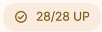
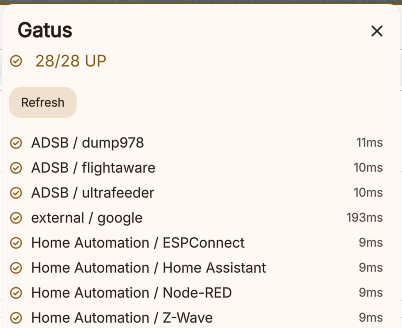

# Gatus Monitor

A DankMaterialShell plugin that monitors your [Gatus](https://gatus.io/) service health dashboard and displays endpoint status in your status bar.

## Screenshots

## Features

- Severity-based status bar pill with precedence `down > unstable > up`
- Pill count behavior:
	- green `check_circle`: count of up endpoints when all are healthy
	- orange `warning`: count of unstable endpoints when none are down
	- red `error`: count of down endpoints when one or more are currently down
- Alert-style pill background for unstable/down states for improved visibility
- Popout endpoint groups: `Down`, `Unstable`, `Up`
- Collapsible groups in popout (Down/Unstable expanded by default, Up collapsed by default)
- Configurable refresh interval and retry backoff when unreachable
- Optional compact pill modes: `full`, `text`, or `icon`

## Setup

1. Open plugin settings.
2. Set the **Gatus URL** (default: `http://localhost:8080`).
3. Optional settings:
	 - **Refresh Interval (seconds)**: `5-300`
	 - **Treat unstable as OK if latest check passed**: if enabled, an endpoint with historical failures is shown as `up` when its latest check succeeds
	 - **Pill Mode**: `full`, `text`, or `icon`

## Status Rules

- `down`: endpoint is currently failing (based on endpoint-level status fields, with fallback to latest result)
- `unstable`: endpoint is up now but has failed checks in its results history
- `up`: endpoint is healthy and not considered unstable

## Requirements

- Gatus must be reachable from the host running DankMaterialShell.
- The Gatus REST API (`/api/v1/endpoints/statuses`) must be accessible (no custom auth configuration required for basic setups).
